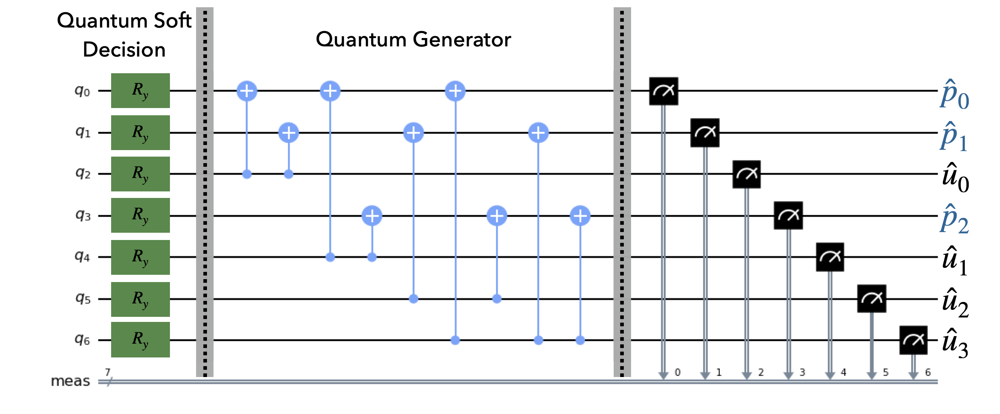

# Quantum Channel Decoder
This repository contains the code for the experiments related to our paper: "Quantum Channel Decoding" as submitted to the [QEC-22 conference](https://qce.quantum.ieee.org/2022/)



## Create and initialize a virtual environment
Make sure you have python 3.8 or later installed. Then run the following commands in a terminal window:
```
python3 -m venv ve
source ve/bin/activate
pip install --upgrade pip numpy pyyaml matplotlib scipy notebook qiskit pylatexenc
pip install amazon-braket-sdk  # Install this if you want to run the Braket examples on your local device
```

## Running the notebook experiments
In a terminal window, go to the directory containing this code and run:
```
jupyter notebook
```
or if running on a remote server:
```
jupyter notebook --ip <IP_ADDRESS>
```

To see how the Quantum Channel Decoder works, open [Quantum Polar Decoding](Polar/QuantumPolar.ipynb) or [Quantum Hamming Decoding](Hamming/QuantumHamming.ipynb) notebooks.

We have saved some of our experiment results in ``yml`` files in the ``ExpFiles`` folders for both Hamming Code and Polar Code. To see these results or to run your own experiments to obtain the frame error rates, use the notebooks [Quantum Polar Experiments](Polar/PolarExperiments.ipynb) or [Quantum Hamming Experiments](Hamming/HammingExperiments.ipynb).

The ``Braket`` folder contains the notebooks for [Quantum Polar Decoding](Braket/QuantumPolar.ipynb) and [Quantum Hamming Decoding](Braket/QuantumHamming.ipynb) written for [Amazon Braket](https://aws.amazon.com/braket). You can use these to run the decoders on real quantum computers or managed simulators.
